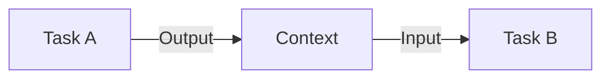

# Tasks

Tasks are the fundamental building blocks of AutoPS. Each task is a PowerShell script that performs a specific action.

## Task Structure

A task is a `.ps1` file that accepts parameters and optionally returns output.

```powershell
# automations/tasks/demo/my_task.ps1
param(
    $InputParam1,
    $InputParam2 = "default"
)

# Your logic here
Write-Host "Processing: $InputParam1"

# Return output (optional)
return @{
    result = "success"
    data = $InputParam1
}
```

## Registering Tasks

Add tasks to `automations/manifest.json`:

```json
{
  "tasks": {
    "my_task": {
      "file": "tasks/demo/my_task.ps1",
      "description": "Does something useful"
    }
  }
}
```

## Task Parameters

Parameters are passed from job/workflow definitions:

```json
{
  "name": "ProcessData",
  "task": "my_task",
  "params": {
    "InputParam1": "value1",
    "InputParam2": "value2"
  }
}
```

## Context Passing

Output from one task becomes available to subsequent tasks:



Access previous task outputs via the context:

```powershell
# In Task B, access Task A's output
$previousResult = $Context.TaskA.result
```

## Retry Logic

Tasks support automatic retry on failure:

```json
{
  "name": "UnstableTask",
  "task": "fetch_data",
  "retries": 3,
  "retry_delay": 10
}
```

| Parameter | Default | Description |
|-----------|---------|-------------|
| `retries` | 0 | Number of retry attempts |
| `retry_delay` | 5 | Seconds between retries |

## State Updates

Tasks can update their state during execution:

```powershell
# Update state (visible in query)
Write-Host "STATE: Processing 50%"
Write-Host "STATE: Finalizing"
```
