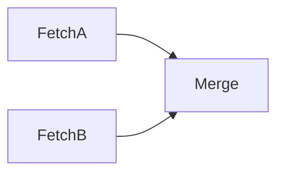

# Workflows

Workflows orchestrate multiple tasks with dependencies, allowing complex pipelines.

## Workflow Structure

A workflow is a JSON file defining tasks and their execution order:

```json
{
  "name": "etl_pipeline",
  "description": "Extract-Transform-Load pipeline",
  "tasks": [
    {
      "name": "Extract",
      "task": "fetch_data"
    },
    {
      "name": "Transform",
      "task": "transform_data",
      "dependsOn": ["Extract"]
    },
    {
      "name": "Load",
      "task": "load_data",
      "dependsOn": ["Transform"]
    }
  ]
}
```

## Dependencies

Use `dependsOn` to specify execution order:


Tasks without dependencies run first. Tasks with dependencies wait until all dependencies complete.

## Parallel Execution

Tasks without interdependencies can run in parallel:

```json
{
  "tasks": [
    { "name": "FetchA", "task": "fetch" },
    { "name": "FetchB", "task": "fetch" },
    { 
      "name": "Merge", 
      "task": "merge",
      "dependsOn": ["FetchA", "FetchB"]
    }
  ]
}
```



## Nested Workflows

Workflows can include other workflows:

```json
{
  "name": "full_pipeline",
  "workflows": [
    { "name": "Prepare", "workflow": "preparation" },
    { "name": "Process", "workflow": "etl_pipeline", "dependsOn": ["Prepare"] }
  ]
}
```

## Registering Workflows

Add to `automations/manifest.json`:

```json
{
  "workflows": {
    "etl_pipeline": {
      "file": "workflows/etl/etl_pipeline.json",
      "description": "ETL Pipeline"
    }
  }
}
```

## Dependency State

When a task is waiting for dependencies, its state shows what it's waiting for:

```
State: Waiting for: Extract
State: Waiting for: TaskA, TaskB
```
