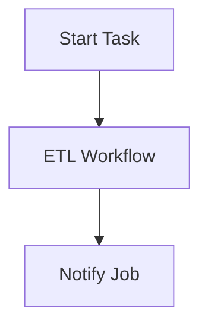

# Jobs

Jobs are the top-level execution unit in AutoPS. They combine tasks, workflows, and child jobs.

## Job Structure

```json
{
  "name": "data_pipeline",
  "description": "Full data processing pipeline",
  "cron": "0 * * * *",
  "tasks": [
    { "name": "Start", "task": "notify", "params": { "message": "Starting..." } }
  ],
  "workflows": [
    { "name": "ETL", "workflow": "etl_pipeline" }
  ],
  "jobs": [
    { "name": "Notify", "job": "notify_job" }
  ]
}
```

## Job Components

| Component | Description |
|-----------|-------------|
| `tasks` | Inline task definitions |
| `workflows` | Referenced workflows |
| `jobs` | Child jobs to execute |

## Execution Order

Steps execute in the order defined, respecting dependencies:



## Scheduling (Cron)

Jobs can be scheduled with cron expressions:

```json
{
  "name": "hourly_sync",
  "cron": "0 * * * *"
}
```

| Expression | Meaning |
|------------|---------|
| `0 * * * *` | Every hour |
| `0 0 * * *` | Daily at midnight |
| `0 0 * * 0` | Weekly on Sunday |
| `*/15 * * * *` | Every 15 minutes |

## Running Jobs

```powershell
# Run manually
./autops.ps1 run data_pipeline

# With parameters
./autops.ps1 run data_pipeline -Params @{ env = "prod" }
```

## Trigger Types

| Type | Description |
|------|-------------|
| `Manual` | Run via CLI |
| `Scheduled` | Run via cron |
| `Invoked by X` | Called by parent job/workflow |

## Shared Execution ID

All tasks, workflows, and child jobs within a job execution share a single `ExecutionId`. This allows querying the entire execution tree:

```powershell
./autops.ps1 query -ExecutionId <guid>
```
