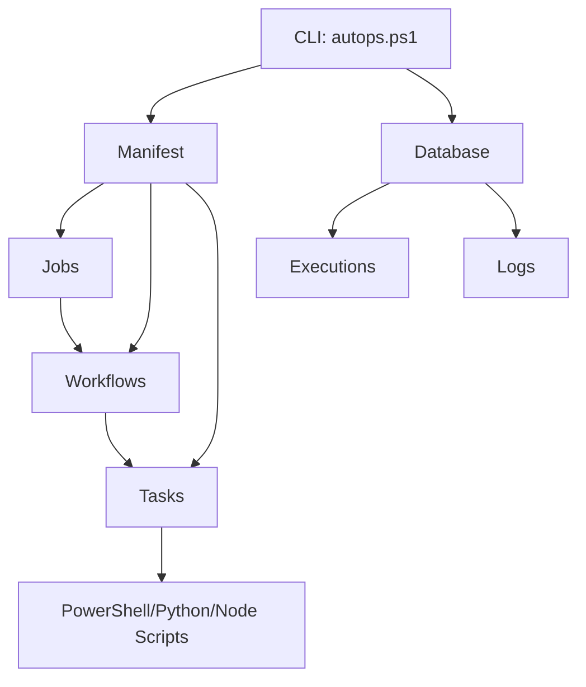

# AutoPS Beta 0.5

<p align="center">
  
</p>

**AutoPS** is a powerful PowerShell automation framework for orchestrating tasks, workflows, and jobs with multi-language runtime support.

---

## ✨ Features

| Feature | Description |
|---------|-------------|
| 🚀 **Task Automation** | Define reusable PowerShell tasks with retry logic |
| 🔄 **Workflow Orchestration** | Chain tasks with dependency management |
| 📅 **Job Scheduling** | Run jobs manually or on cron schedules |
| 🔁 **Retry Logic** | Configurable retries with delays |
| 📊 **Execution Tracking** | Query and monitor all executions |
| 📝 **Structured Logging** | Filter logs by level, time, keywords |
| 🌐 **Multi-Runtime** | Support for Python, Node.js, and more |

---

## 🚀 Quick Start

```powershell
# Initialize and check system health
./autops.ps1 init

# Run a job
./autops.ps1 run hello_world

# Query recent executions
./autops.ps1 query -Top 10

# View error logs
./autops.ps1 logs -Level Error
```

---

## 📐 Architecture



---

## 📚 Documentation

### Getting Started
- [Installation](./getting-started/installation.md) - Setup instructions
- [Quick Start](./getting-started/quickstart.md) - Your first job

### Core Concepts
- [Tasks](./concepts/tasks.md) - Building blocks of automation
- [Workflows](./concepts/workflows.md) - Task orchestration
- [Jobs](./concepts/jobs.md) - Top-level execution units
- [Manifest](./concepts/manifest.md) - Configuration registry

### CLI Reference
- [Commands](./cli/commands.md) - Complete command reference
- [Query](./cli/query.md) - Execution history queries
- [Logs](./cli/logs.md) - Log filtering and search

### Integrations
- [Overview](./integrations/overview.md) - Available integrations
- [Filesystem](./integrations/filesystem.md) - File operations
- [Git](./integrations/git.md) - Version control
- [HTTP](./integrations/http.md) - REST API calls

### Examples
- [ETL Pipeline](./examples/etl-pipeline.md) - Data processing workflow
- [Retry Logic](./examples/retry-logic.md) - Handling failures

---

## 📋 Requirements

- PowerShell 5.1 or higher
- Windows, macOS, or Linux

---

## 📄 License

MIT License - See LICENSE file for details.
